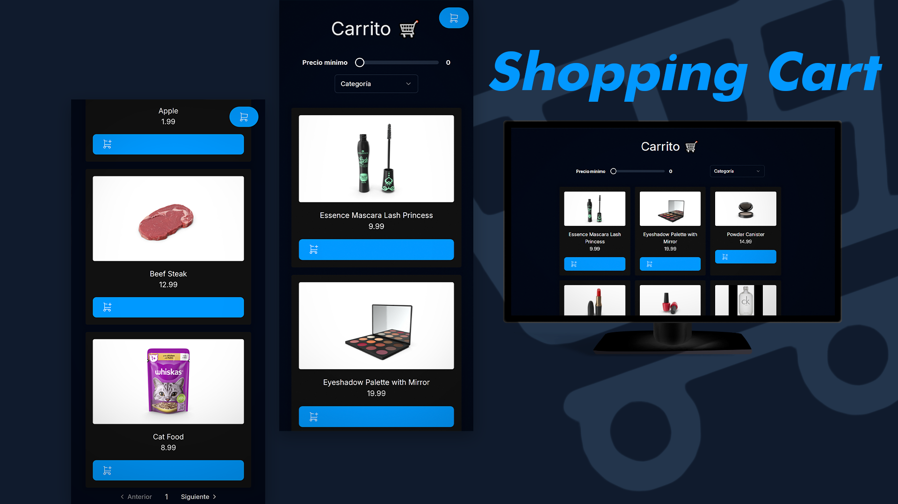

# Shopping Cart

A web with a simple grid of products that let's add/remove product from the cart using React.

This project is for practicing React and Context with Reducers. I'm using that to have sort of a global context within my app.



## Installation

Install my-project with npm or pnpm. In the examples I'll be using `pnpm` but you can replace it with `npm` and it'd too.

### Pre-requisites

In order to work you should have git and Node installed on your machine already.

### Install and run project

1. Clone this repository

```bash
  git clone https://github.com/MalconH/shopping-cart.git
  cd shopping-cart
```

2. Run pnpm to install dependencies

```bash
  pnpm install
```

3. Run development environment

```bash
  pnpm run dev
```

4. Additional commands

```bash
# Build files
pnpm run build

# Preview built files in browser
pnpm run preview
```

## Links

- Look the [project code](/src/).
- Visit this [website](https://malconh.github.io/shopping-cart) to view the app.

## Credits

Thanks to [Midu](https://twitter.com/midudev) for his React course, I built this project following his course (though I added some features and changes). Midu is such a great dev and teacher, all credits to him!
